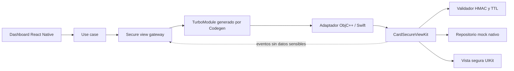

# Card Secure View

Prueba técnica en React Native que muestra datos sensibles de una tarjeta dentro de una vista nativa iOS protegida. React Native controla la experiencia general, pero el PAN y el CVV se crean, conservan y renderizan exclusivamente en Swift.

<p align="center">
  
</p>

## Estado de la entrega

| Área | Estado |
| --- | --- |
| Aplicación React Native y dashboard mock | Completo |
| Navegación inferior y pantallas Coming Soon | Completo |
| Design tokens y componentes Atomic Design | Completo |
| Librería Swift reutilizable `CardSecureViewKit` | Completo |
| Integración iOS mediante TurboModule/Codegen | Completo |
| Protecciones de ciclo de vida y captura | Completo |
| Pruebas unitarias, lint, tipos y build iOS | Completo |
| Implementación nativa Android | Fuera del alcance priorizado |

La entrega prioriza iOS. Android conserva el scaffold generado por React Native, pero no implementa todavía el módulo nativo seguro.

## Alcance funcional

- Dashboard financiero construido con datos mock locales.
- Tabs de Inicio, Tarjetas y Perfil; las áreas no requeridas muestran `Coming Soon`.
- Acción **Ver datos sensibles** conectada al módulo nativo.
- Token HMAC-SHA256 de vida corta para la demostración.
- Validación nativa de firma, `cardId`, emisión y expiración.
- Presentación UIKit de nombre, PAN, vencimiento y CVV.
- Cierre manual, por timeout, captura de pantalla o token inválido.
- Eventos hacia React Native que contienen únicamente metadatos.

No existen usuarios, autenticación ni backend porque el reto solicita un escenario demostrativo con información mock. En producción, el token debe ser emitido por un backend y los secretos no deben distribuirse dentro de la aplicación.

## Requisitos

- macOS y Xcode con un runtime de iOS Simulator instalado.
- Node.js `>= 22.11.0`.
- Ruby y Bundler.
- CocoaPods instalado mediante el `Gemfile` del proyecto.

## Instalación

Desde la raíz del proyecto:

```sh
npm install
bundle install
cd ios
bundle exec pod install
cd ..
```

Inicia Metro:

```sh
npm start
```

En otra terminal, ejecuta iOS:

```sh
npm run ios
```

También puedes abrir `ios/CardSecureViewApp.xcworkspace` en Xcode, elegir un simulador y ejecutar el esquema `CardSecureViewApp`.

## Arquitectura



La capa React Native sigue Atomic Design y separa la lógica de presentación en hooks. La integración nativa usa un puerto y un gateway para evitar que la UI dependa directamente del TurboModule. El adaptador del host es delgado; validación, estado y presentación viven en el paquete Swift reutilizable.

```text
src/
├── app/                    # navegación y composición de la aplicación
├── capabilities/
│   ├── cards/              # dominio, caso de uso, mocks y dashboard
│   ├── coming-soon/        # estados de tabs fuera del alcance
│   └── secure-view/        # puerto, caso de uso, gateway y hooks
└── shared/
    └── design-system/
        ├── components/     # atoms y molecules reutilizables
        └── tokens/         # color, tipografía, espaciado, radios y sombras
specs/                      # contrato TurboModule para Codegen
ios/
├── CardSecureViewApp/      # adaptador nativo del host
└── Packages/
    └── CardSecureViewKit/  # librería Swift independiente
```

La explicación detallada se encuentra en [docs/architecture/overview.md](docs/architecture/overview.md) y la API pública del paquete en [ios/Packages/CardSecureViewKit/README.md](ios/Packages/CardSecureViewKit/README.md).

## Límite de seguridad

| Puede cruzar el bridge | Permanece exclusivamente en Swift |
| --- | --- |
| `cardId` opaco | PAN completo |
| Token firmado de vida corta | CVV |
| Eventos de estado | Registro mock de la tarjeta |
| Motivos de cierre o validación | Contenido de las etiquetas UIKit |

El flujo es el siguiente:

1. React Native solicita un token de demostración usando únicamente el `cardId`.
2. React Native abre la vista enviando `cardId` y token.
3. Swift valida firma, correspondencia del identificador y TTL máximo de 60 segundos.
4. Swift obtiene la tarjeta mock y presenta sus datos en UIKit.
5. La sesión oculta y limpia el contenido al cerrarse; React Native recibe solo el evento resultante.

### Protecciones implementadas

- Timeout configurable entre 30 y 60 segundos; la app usa 45 segundos.
- Escudo de privacidad al pasar a segundo plano o perder estado activo.
- Ocultamiento preventivo al detectar grabación o duplicación de pantalla.
- Ocultamiento y cierre al recibir una notificación de screenshot.
- Revalidación de expiración antes de volver a revelar contenido al regresar al foreground.
- Limpieza de etiquetas y referencias sensibles antes del dismissal.
- Prevención de aperturas simultáneas.
- Ausencia de logs con PAN o CVV.

> iOS informa una captura de pantalla después de que el sistema la realizó. Con APIs públicas no es posible impedirla de forma garantizada; la aplicación responde ocultando y cerrando la sesión. La grabación o duplicación de pantalla sí se detecta mientras está activa y el contenido se mantiene oculto.

## Eventos del módulo

| Evento | Propósito |
| --- | --- |
| `opened` | La sesión nativa fue presentada. |
| `cardDataShown` | El contenido fue revelado dentro de UIKit. |
| `validationError` | El token o la solicitud no superó la validación. |
| `closed` | La sesión terminó manualmente, por timeout o por una protección. |

Ningún evento incluye PAN, CVV ni otros datos de tarjeta.

## Validación y pruebas

Ejecuta las comprobaciones de JavaScript/TypeScript:

```sh
npm run test:ci
npm run lint
npm run typecheck
```

Ejecuta las pruebas del paquete Swift, reemplazando el nombre del simulador si fuera necesario:

```sh
cd ios/Packages/CardSecureViewKit
xcodebuild \
  -scheme CardSecureViewKit \
  -destination 'platform=iOS Simulator,name=iPhone 17 Pro' \
  test
```

Verifica el build completo de la aplicación:

```sh
cd ios
xcodebuild \
  -workspace CardSecureViewApp.xcworkspace \
  -scheme CardSecureViewApp \
  -destination 'generic/platform=iOS Simulator' \
  build
```

Resultado verificado en esta entrega:

- 19/19 pruebas nativas aprobadas.
- 5/5 pruebas Jest aprobadas.
- ESLint y TypeScript sin errores.
- Build completo de iOS exitoso.
- 1,000 validaciones HMAC en aproximadamente 15–19 ms en simulador.

La matriz reproducible de casos y evidencias está en [docs/qa/security-test-matrix.md](docs/qa/security-test-matrix.md).

## Decisiones y compromisos

- **Swift Package:** mantiene el componente seguro reutilizable y desacoplado de React Native.
- **TurboModule con New Architecture:** ofrece un contrato tipado y evita una integración basada en bridge legacy.
- **Adaptador delgado:** ObjC++ y el archivo Swift del host solo traducen llamadas y eventos.
- **Datos mock nativos:** permiten demostrar el límite de seguridad sin usuarios, API ni persistencia.
- **Emisor local de token:** es deliberadamente demostrativo. Un entorno real debe usar backend, rotación de claves y almacenamiento protegido.
- **iOS primero:** concentra la calidad en la plataforma solicitada; Android nativo queda documentado como extensión.

## Checklist del reto

- [x] React Native invoca la funcionalidad nativa con `cardId` y token.
- [x] El token firmado tiene una vigencia corta y se valida en Swift.
- [x] PAN y CVV nunca regresan a JavaScript.
- [x] Los datos sensibles se muestran en una vista completamente nativa.
- [x] La vista se protege al entrar en background y durante captura activa.
- [x] La sesión se cierra manualmente o por timeout.
- [x] Los eventos nativos contienen únicamente metadatos.
- [x] La funcionalidad está encapsulada en una librería Swift reutilizable.
- [x] Existen pruebas de validación, lifecycle, captura, presentación y rendimiento.

## Recorrido rápido para evaluación

1. Ejecuta la app en iOS Simulator.
2. En **Inicio**, pulsa **Ver datos sensibles**.
3. Comprueba que la pantalla nativa muestra los datos mock y que **Ocultar datos** la cierra.
4. Repite el flujo y envía la app al background para comprobar el escudo de privacidad.
5. Revisa los tabs **Tarjetas** y **Perfil** para ver los estados `Coming Soon`.
6. Ejecuta los comandos de validación de la sección anterior.
