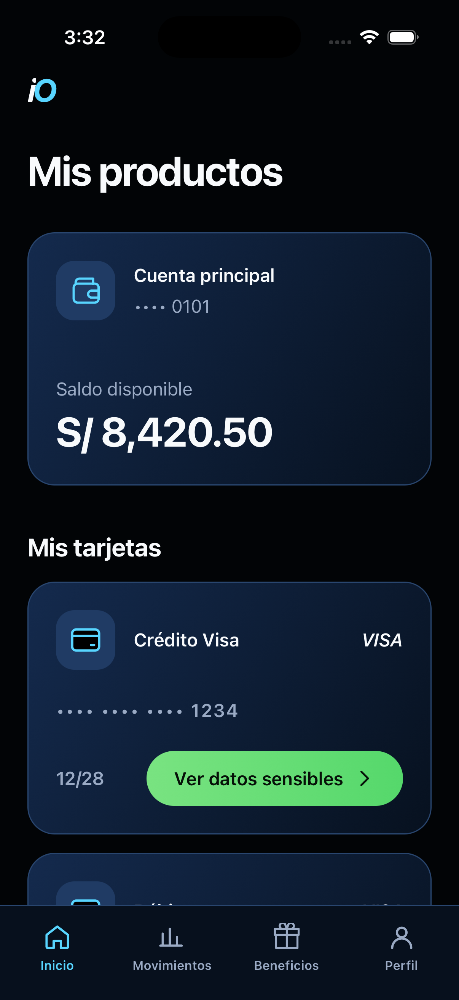
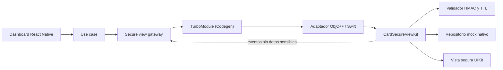

# Card Secure View

Este proyecto es la solución a un **reto técnico** (Frontend iOS — "Card Secure View"): una app en React Native que muestra los datos sensibles de una tarjeta dentro de una vista nativa protegida en iOS. React Native maneja toda la experiencia de la app, pero el PAN y el CVV se generan, guardan y muestran únicamente en Swift — nunca cruzan hacia JavaScript.

> **Es solo un ejercicio técnico.** No es un producto real, no está afiliado a ninguna empresa ni banco, y todos los datos (tarjetas, usuario, montos) son inventados. Los colores, el nombre "IO Challenge" y el estilo visual se eligieron libremente para el reto — no representan ni copian la identidad de ninguna marca.

La parte nativa se separó en una librería propia publicada en npm: [`@aranzatech/react-native-card-secure-view`](https://www.npmjs.com/package/@aranzatech/react-native-card-secure-view) ([repo](https://github.com/aranzatech/react-native-card-secure-view)). Esta app la consume como si fuera cualquier otra dependencia — es la "app de ejemplo" del reto.

<p align="center">
  
</p>

## Qué se pidió y qué se hizo

### Parte 1 — Dashboard en React Native

- **Dashboard con cuentas y tarjetas mock** → hecho, con datos locales (sin backend).
- **PAN enmascarado y fecha MM/AA** → cada tarjeta muestra `**** **** **** 1234` y el vencimiento, nunca el número completo.
- **Botón "Ver datos sensibles"** → al tocarlo, la app pide un token seguro y abre la vista nativa mandando `cardId` + token.

### Parte 2 — Módulo nativo (Swift)

- **Vista segura a pantalla completa** con validación de token (HMAC-SHA256 simulado, con expiración y verificación de firma).
- **Si el token es válido**: muestra PAN completo, CVV, vencimiento y titular — todo renderizado en UIKit, nunca en JS.
- **Si es inválido o expiró**: se muestra una pantalla de error nativa con el motivo y opción de cerrar.
- **Seguridad mínima pedida por el reto**:
  - Se oculta el contenido si detecta grabación/duplicación de pantalla, y cierra la sesión si detecta un screenshot (iOS no permite bloquear el screenshot en sí, solo reaccionar después).
  - Se oculta automáticamente al pasar a segundo plano.
  - Timeout de sesión (45s, dentro del rango de 30–60s pedido) + botón para ocultar manualmente.
  - Cero logs con datos sensibles (se puede verificar con un grep, no hay ni un `print`/`NSLog` con PAN o CVV en todo el proyecto).
- **Los 4 eventos hacia JS**: `opened`, `cardDataShown`, `validationError`, `closed` — todos con metadata únicamente (nunca datos de tarjeta).

### Extra valorado

- **Librería publicada en npm** con nombre con scope (`@aranzatech/...`) para evitar choques de nombres, repo propio en GitHub con su propio CI/CD.
- Solo iOS por ahora (Android se dejó documentado como pendiente, no estaba obligado ya que el reto pedía Kotlin *o* Swift).

### Parte 3 — Opcionales para subir de nivel

- **Login con Firebase (Email/Password)**: la app arranca en una pantalla de login; solo se puede entrar al dashboard con el usuario de prueba de abajo. Ver la sección [Autenticación](#autenticación).
- **State management**: el estado de sesión se maneja con **Zustand** (`useAuthStore`).
- **Performance**: listas con `FlatList` + `memo` + hooks separados de la presentación para evitar renders de más.

## Autenticación

La app pide login antes de mostrar el dashboard, usando Firebase Authentication:

- `src/capabilities/auth/` sigue la misma organización que el resto del proyecto (dominio, caso de uso, gateway a Firebase, pantalla de login).
- El estado de sesión vive en un store de Zustand y `AuthGate` (en `src/app/`) decide si mostrar el login o el dashboard.
- Como Firebase Auth guarda la sesión en el Keychain, si ya iniciaste sesión una vez, la próxima vez que abras la app entra directo al dashboard. Hay un botón **Cerrar sesión** arriba a la derecha para volver a probar el login.
- Los errores de Firebase se traducen a mensajes simples en español; nunca se loguea el correo ni la contraseña.

**Usuario de prueba** (creado a propósito para esta demo):

```
Correo:      test@retoyape.com
Contraseña:  Test1234!
```

### Configurar tu propio Firebase (si lo necesitas)

Si vas a compilar el proyecto con tu propio proyecto de Firebase en vez del que ya viene configurado:

1. Crea un proyecto en la [consola de Firebase](https://console.firebase.google.com/) y agrega una app iOS con bundle ID `com.iochallenge.cardsecureview`.
2. Habilita el proveedor **Email/Password** en Authentication → Sign-in method.
3. Crea el usuario de prueba de arriba en Authentication → Users.
4. Descarga `GoogleService-Info.plist` y reemplaza el que está en `ios/CardSecureViewApp/GoogleService-Info.plist`.
5. Corre `bundle exec pod install` dentro de `ios/`.

## Requisitos

- macOS y Xcode con un runtime de iOS Simulator instalado.
- Node.js `>= 22.11.0`.
- Ruby y Bundler.
- CocoaPods (vía el `Gemfile` del proyecto).

## Cómo correrlo

```sh
npm install
bundle install
cd ios
bundle exec pod install
cd ..
```

Metro en una terminal:

```sh
npm start
```

Y en otra, la app en iOS:

```sh
npm run ios
```

También puedes abrir `ios/CardSecureViewApp.xcworkspace` en Xcode y correr el esquema `CardSecureViewApp`.

## Cómo está armado



El lado de React Native separa la lógica en capabilities (`auth`, `cards`, `secure-view`) siguiendo Clean Architecture: dominio, casos de uso, infraestructura y presentación. La UI nunca habla directo con el módulo nativo — pasa por un puerto/gateway, así que si mañana cambia la implementación nativa, no hay que tocar la pantalla.

```text
src/
├── app/                    # navegación, AuthGate y composición de la app
├── capabilities/
│   ├── auth/               # login: dominio, caso de uso, gateway Firebase, store, pantalla
│   ├── cards/               # dominio, caso de uso, mocks y dashboard
│   ├── coming-soon/        # tabs fuera del alcance del reto
│   └── secure-view/        # puerto, caso de uso, gateway y hooks hacia el módulo nativo
└── shared/
    └── design-system/      # componentes y tokens (color, tipografía, espaciado...)
node_modules/@aranzatech/react-native-card-secure-view/
├── src/                    # contrato TurboModule (Codegen) y API pública JS
└── ios/                    # adaptador nativo + CardSecureViewKit (Swift)
```

Más detalle en [docs/architecture/overview.md](docs/architecture/overview.md), y la documentación de la librería nativa está en su propio [repositorio](https://github.com/aranzatech/react-native-card-secure-view).

## Qué puede cruzar el bridge y qué no

| Puede llegar a JS | Se queda solo en Swift |
| --- | --- |
| `cardId` (un identificador, no el número real) | PAN completo |
| Token firmado de vida corta | CVV |
| Eventos de estado (opened, closed, etc.) | Registro mock de la tarjeta |
| Motivos de cierre o error | Contenido real mostrado en pantalla |

> Nota honesta: iOS avisa que hubo un screenshot *después* de que ya se tomó — no existe forma pública de bloquearlo antes. La app reacciona ocultando y cerrando la sesión apenas se entera. La grabación/duplicación de pantalla sí se puede detectar mientras está activa, y ahí el contenido se mantiene oculto todo el tiempo.

## Pruebas

JavaScript/TypeScript:

```sh
npm run test:ci
npm run lint
npm run typecheck
```

El paquete Swift (desde `node_modules` o un clon de la librería):

```sh
cd node_modules/@aranzatech/react-native-card-secure-view/ios/CardSecureViewKit
xcodebuild -scheme CardSecureViewKit -destination 'platform=iOS Simulator,name=iPhone 17 Pro' test
```

Build completo de la app:

```sh
cd ios
xcodebuild -workspace CardSecureViewApp.xcworkspace -scheme CardSecureViewApp -destination 'generic/platform=iOS Simulator' build
```

Todo esto está corriendo en verde en la entrega actual (tests Jest, tests Swift, lint, typecheck y build de Xcode). Más detalle de casos de seguridad probados en [docs/qa/security-test-matrix.md](docs/qa/security-test-matrix.md).

## Algunas decisiones que tomé

- Separé la parte nativa en un paquete Swift independiente y la publiqué como librería en npm, en vez de dejarla enterrada dentro de la app — así queda claro que es reutilizable de verdad, no solo una promesa.
- Elegí TurboModule (New Architecture) en vez de la integración por bridge clásico, para tener un contrato tipado entre JS y nativo.
- El emisor de tokens y los datos de tarjeta son mocks a propósito — en un caso real, el token lo emitiría un backend y los secretos no viajarían dentro de la app.
- Prioricé iOS. Android se quedó con el scaffold que genera React Native por defecto, sin el módulo nativo implementado.

## Checklist del reto

- [x] React Native invoca el módulo nativo con `cardId` y token.
- [x] El token tiene vigencia corta y se valida en Swift.
- [x] PAN y CVV nunca regresan a JavaScript.
- [x] Los datos sensibles se muestran en una vista completamente nativa.
- [x] La vista se protege en background y durante captura activa.
- [x] La sesión se cierra manualmente o por timeout.
- [x] Los eventos nativos solo llevan metadata.
- [x] La funcionalidad nativa está en una librería reutilizable, publicada en npm.
- [x] Hay pruebas de validación, lifecycle, captura, presentación y rendimiento.
- [x] Login con Firebase usando un usuario predefinido.
- [x] State management (Zustand) para el estado de sesión.

## Para probar rápido

1. Corre la app en el simulador de iOS.
2. En la pantalla de login, usa las credenciales de la sección [Autenticación](#autenticación).
3. Confirma que entra al **Dashboard** después del login.
4. En **Inicio**, toca **Ver datos sensibles**.
5. La pantalla nativa debería mostrar los datos mock; **Ocultar datos** la cierra.
6. Repite el flujo y manda la app a background para ver el escudo de privacidad.
7. Los tabs **Tarjetas** y **Perfil** muestran un estado "Coming Soon" (fuera del alcance del reto).
8. Toca **Cerrar sesión** (arriba a la derecha) para volver al login.
9. Corre los comandos de la sección [Pruebas](#pruebas) si quieres verificar todo por tu cuenta.
