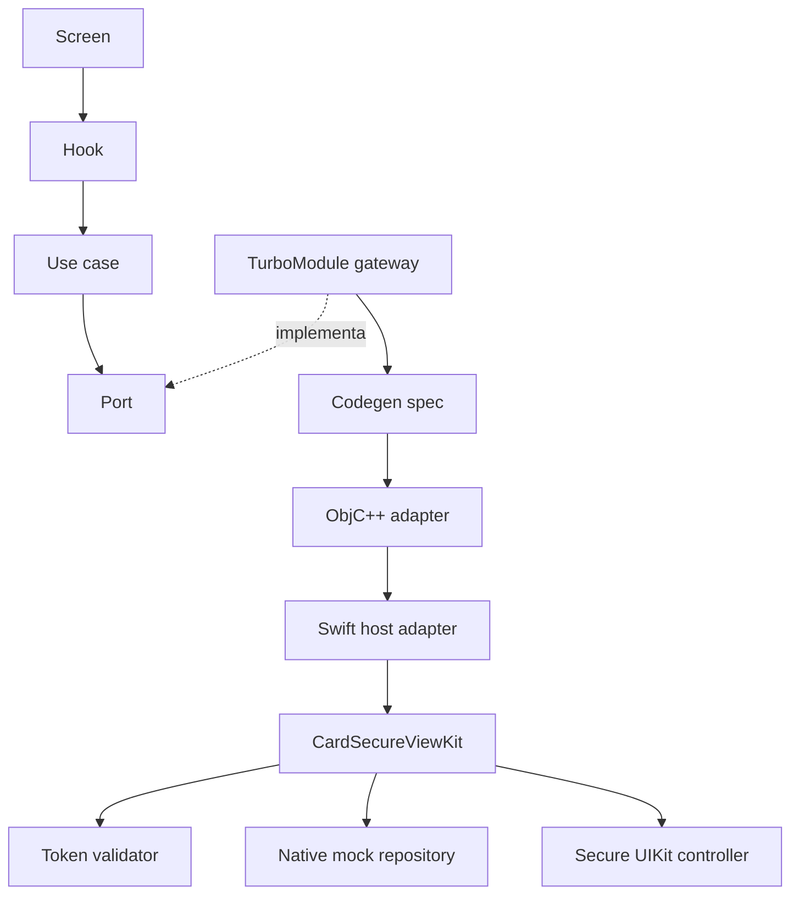
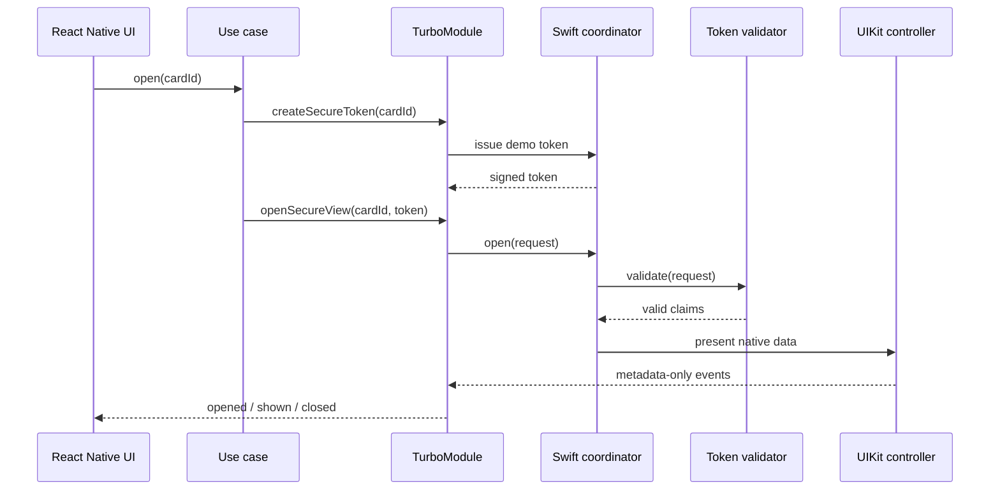
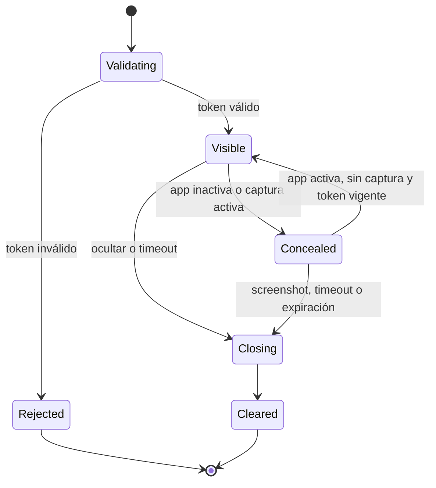

# Arquitectura de Card Secure View

## Objetivo

El diseño mantiene los datos sensibles fuera del runtime de JavaScript. React Native solicita y presenta el flujo, mientras Swift valida la autorización, obtiene la tarjeta mock y renderiza PAN y CVV en una vista UIKit propia.

## Componentes

| Componente | Responsabilidad |
| --- | --- |
| Dashboard y componentes Atomic | Experiencia general, navegación y estados no sensibles. |
| `useSecureViewEvents` | Suscripción y respuesta accesible a eventos nativos. |
| `openSecureCardView` | Orquesta la obtención del token y apertura del flujo. |
| `NativeCardSecureViewGateway` | Implementa el puerto de aplicación sobre el TurboModule. |
| `NativeCardSecureView` | Contrato tipado que Codegen publica para iOS. |
| `RCTNativeCardSecureView` | Capa ObjC++ requerida por React Native New Architecture. |
| `NativeCardSecureViewAdapter` | Traduce Promises y eventos hacia Swift sin lógica de dominio. |
| `CardSecureViewCoordinator` | Valida, evita duplicados y controla la presentación. |
| `SecureTokenValidator` | Verifica formato, firma HMAC, `cardId`, emisión y expiración. |
| Repositorio mock nativo | Crea los datos sensibles solo después de validar la solicitud. |
| `CardSecureViewController` | Renderiza, protege, oculta y limpia el contenido. |

## Dependencias

Las dependencias apuntan hacia contratos y casos de uso. La pantalla no conoce APIs nativas y el paquete Swift no conoce React Native.

## Secuencia de apertura

La primera llamada existe únicamente para que el reto sea autónomo. En producción, `createSecureToken` se reemplaza por una llamada autenticada al backend; el flujo de apertura y la validación nativa se mantienen.

## Modelo del token de demostración

El token contiene una cabecera, claims y una firma HMAC-SHA256. Los claims ligan la autorización a un `cardId`, una fecha de emisión y una expiración. La validación exige:

- Estructura y codificación válidas.
- Algoritmo esperado.
- Firma comparada en tiempo constante.
- Mismo `cardId` que la solicitud.
- Emisión no ubicada en el futuro fuera de tolerancia.
- Expiración posterior al instante actual.
- TTL total no mayor de 60 segundos.

La clave incluida en el binario solo permite ejecutar la demostración. No representa una estrategia válida de administración de secretos para producción.

## Estados de la sesión segura

Antes de regresar de `Concealed` a `Visible`, la sesión vuelve a comprobar la expiración. Al cerrar, las etiquetas se vacían y se liberan referencias al modelo sensible.

## Superficie de eventos

Los eventos exponen estado operativo, nunca contenido de tarjeta. El adaptador puede transmitir el nombre del evento, un código de error controlado o un motivo de cierre. No debe agregar PAN, CVV, nombre del titular, screenshots ni descripciones interpoladas que contengan valores sensibles.

## Decisiones de diseño

### Swift Package independiente

El dominio seguro y UIKit viven en `CardSecureViewKit`. Esto permite reutilizar la funcionalidad desde otra aplicación iOS y probarla sin levantar React Native.

### TurboModule y Codegen

El contrato TypeScript genera la interfaz de New Architecture. ObjC++ satisface el protocolo generado y delega inmediatamente al adaptador Swift. La solución evita que la lógica de seguridad quede fragmentada entre lenguajes.

### Atomic Design y tokens

La interfaz React Native se organiza en atoms, molecules, organisms y templates. Colores, medidas, radios, espaciado y tipografía viven en tokens para evitar valores visuales dispersos y facilitar una futura evolución de marca.

### Hooks por componente o feature

El estado, las acciones y la suscripción a eventos se extraen de los archivos visuales. Los componentes permanecen pequeños, declarativos y reutilizables.

### Defensa realista ante capturas

Las APIs públicas de iOS permiten observar grabación o duplicación activa y reaccionar a screenshots una vez ocurren. Por ello, la estrategia combina ocultamiento durante captura activa, escudo de privacidad en lifecycle, cierre post-screenshot, timeout y minimización del tiempo de exposición. No se afirma que una captura estática pueda bloquearse de forma absoluta.

## Extensiones futuras

- Sustituir el emisor local por un endpoint autenticado y aplicar rotación de claves.
- Usar un proveedor seguro o datos cifrados en lugar del repositorio mock.
- Agregar una implementación Android equivalente detrás del mismo puerto.
- Añadir pruebas end-to-end en dispositivo físico para grabación, mirroring y screenshots.
- Incorporar telemetría de metadatos con una política explícita de redacción.
